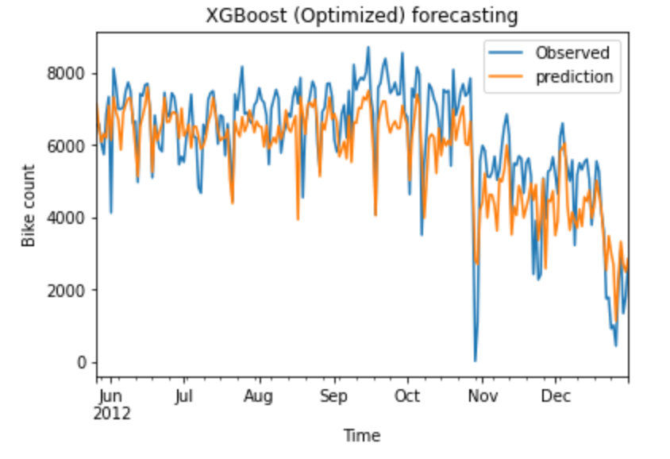
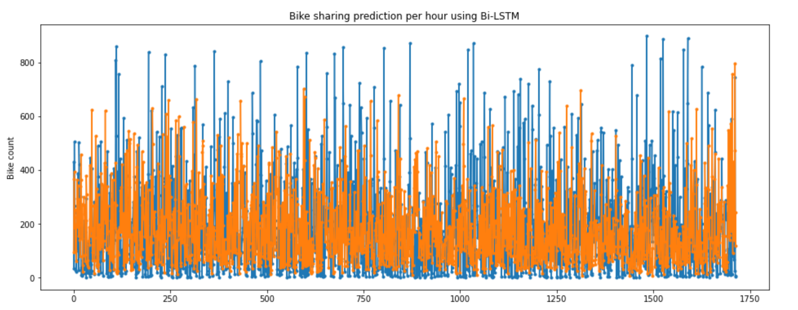
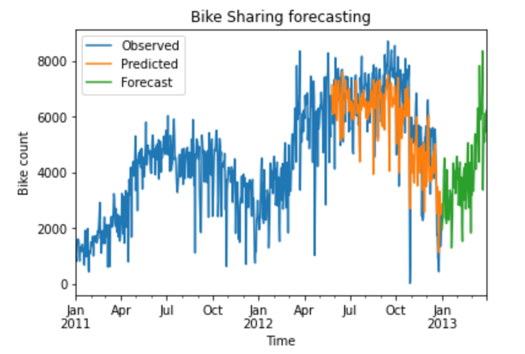

# Time series prediction for Bike sharing demand

Dataset: https://archive.ics.uci.edu/ml/datasets/Bike+Sharing+Dataset

The data was collected with:
1. one-hour sampling rate over a period between Jan 2011 and Dec 2012 (24 months) were measured. Thirteen independent variables a numerical dependent variable Bike count with 17,379 observations are available. Our goal is to predict the Bike sharing demand into the future. I train a Neural network to make prediction on this dataset.

2. one-day sampling rate over a period between Jan 2011 and Dec 2012 (24 months) were measured. Twelve independent variables a numerical dependent variable Bike count with 731 observations are available. Our goal is to predict the Bike sharing demand into the future. I train a Machine learning model to make prediction on this dataset.

# Prediction
1. **Bike sharing demand prediction using XGBoost**- Trained on daily data of 1.5 years; Prediction on remaining 6 months.

2. **Bike sharing demand prediction using Bi-directional LSTM** - Trained on hourly data of 1 year 10 months; prediction on remaining 2 months.

3. **Bike demand forecasting for the next 3 months using XGBoost**

  We add dummy data for 3 months for the year 2013 and make forecasts.  

Please find detailed analysis and experiments in the respective notebooks.

# Description of files/folders submitted for this task:
1. `notebooks/eda.ipynb`: Exploratory analysis of the daily bike sharing demand between Jan 2011 and Dec 2012.

2. `notebooks/ml_approach.ipynb`: Analysis, training and prediction of daily bike sharing demand using a ML model.

3. `notebooks/nn_approach.ipynb`: Analysis, training and prediction of hourly bike sharing demand using a Deep Learning model.

4. `src/utils.py`: Implements various supplementary functions used in the following files.

5. `src/ml_model.py`: Production ready code to predict real-time daily bike sharing demand using the best performing ML model.

6. `src/nn_model.py`: Production ready code to predict real-time hourly bike sharing demand using the best performing RNN model.

7. `dataset/`: Contains existing data and dummy new data to test the production code.

8. `models/`: Contains the saved best performing models (ML and NN).

9. `plots/`: Contains various plots generated during model prediction.

# Steps to run the script:
1. Download the code repository from this repository.

2. Install the dependencies

  `$ pip install -r requirements.txt`

## Machine Learning approach

3. Run the  `src/ml_model.py` script with 2 arguments- `dataset/new_data.csv` (new incoming dummy data to make prediction on) and `models/ml.model` (Best performing ML model). Example:

  `$ python src/ml_model.py dataset/new_data.csv models/ml.model
  `

  Voila! The predicted bike sharing demand is printed on the console.

## Deep learning approach
4. Run the `src/nn_model.py` script with 3 arguments - `dataset/hourly_new_data.csv` (new incoming dummy data to make prediction on), `models/nn_model.json` (Best performing RNN model) and `models/nn_model.h5` (Model weights). Example:

  `$python src/nn_model.py dataset/hourly_new_data.csv models/nn_model.json models/nn_model.h5`

  `
  Voila! The predicted bike sharing demand is printed on the console.

We can run these models on real-time data once we have a continuous stream of incoming data. In that case, after prediction on the new data, the new data is appended to the training dataset and the model is trained anew on this combined dataset. This is a recursive process which makes the model performance better with incoming data.

# Future work
1. Test other algorithms against these baseline models and integrate the best performing model into the pipeline.
